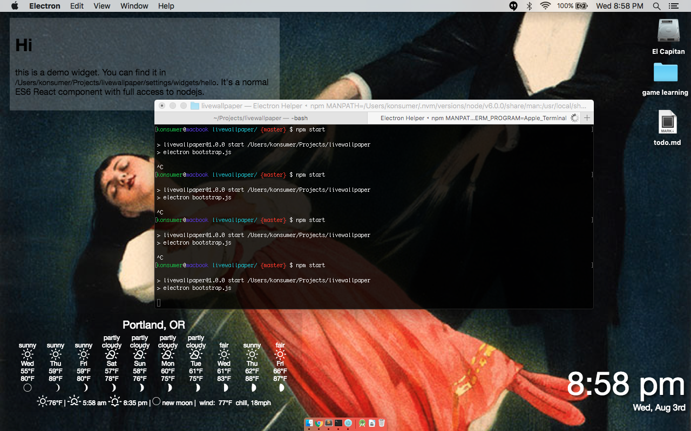

# livewallpaper

Cross-platform live desktop wallpaper for everyone, using react.

It's alot like [uebersicht](https://github.com/felixhageloh/uebersicht), but with react & electron.

With it you can make react components for your desktop!

You can control parent-styling (in `settings/global.css`) and make your own widgets, using the full power of nodejs, react, and electron.

## STILL IN PROGRESS

### todo

*  improve live-reloading
*  better reloading of css
*  use notification icon, allow pinning on different desktops, hide in task-manager
*  move settings into more appropriate user-settings folders
*  improve error-handling
*  improve branding (icon, help/about pages, name, etc)